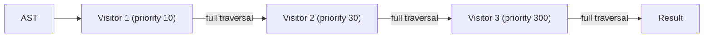
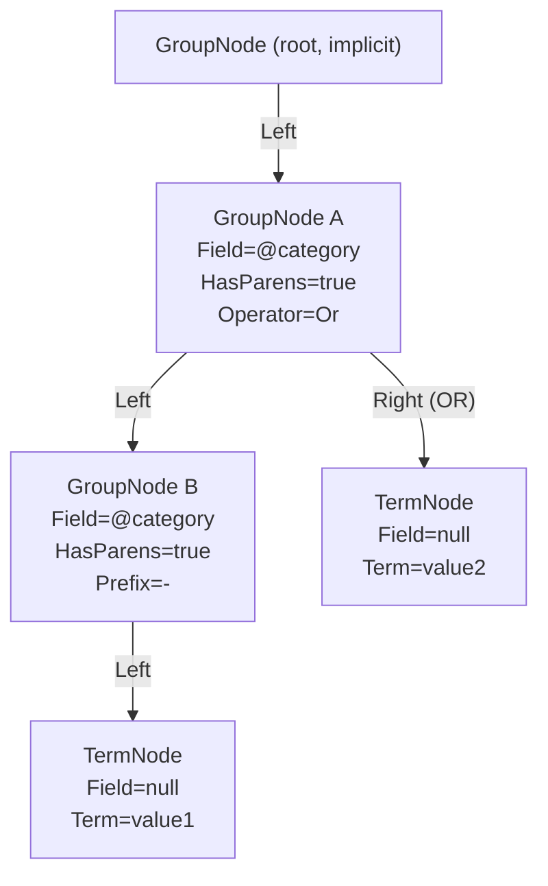

# Nested Queries and Visitor Traversal

This document provides an in-depth explanation of how the Foundatio.Parsers visitor pattern handles nested and hierarchical query structures, how fields are scoped in nested contexts, and how Elasticsearch nested document support works.

## Visitor Traversal Order

### How the Base Class Traverses the AST

When a query is parsed, it produces an Abstract Syntax Tree (AST) of nodes. Each `GroupNode` has a `Left` and `Right` child, forming a binary tree. The [`GroupNode.Children`](https://github.com/FoundatioFx/Foundatio.Parsers/blob/main/src/Foundatio.Parsers.LuceneQueries/Nodes/GroupNode.cs) property always yields `Left` first, then `Right`:

```csharp
// From GroupNode.Children
var children = new List<IQueryNode>();

if (Left != null)
    children.Add(Left);

if (Right != null)
    children.Add(Right);
```

The base visitor class [`QueryNodeVisitorBase.VisitAsync(GroupNode)`](https://github.com/FoundatioFx/Foundatio.Parsers/blob/main/src/Foundatio.Parsers.LuceneQueries/Visitors/QueryNodeVisitorBase.cs) iterates these children in order:

```csharp
public virtual async Task VisitAsync(GroupNode node, IQueryVisitorContext context)
{
    foreach (var child in node.Children)
        await VisitAsync(child, context).ConfigureAwait(false);
}
```

The base implementation does **not** perform any action on the `GroupNode` itself. It only recurses into the node's children. This means a subclass controls whether it processes a `GroupNode` before or after its children based on where it places its logic relative to the `base.VisitAsync()` call.

### Dispatch Mechanism

When `node.AcceptAsync(visitor, context)` is called, [`QueryNodeBase.AcceptAsync`](https://github.com/FoundatioFx/Foundatio.Parsers/blob/main/src/Foundatio.Parsers.LuceneQueries/Nodes/QueryNodeBase.cs) dispatches to the visitor's type-specific `VisitAsync` overload based on the node's runtime type:

```csharp
// From QueryNodeBase.AcceptAsync
if (this is GroupNode groupNode)
    return visitor.VisitAsync(groupNode, context);

if (this is TermNode termNode)
    return visitor.VisitAsync(termNode, context);

// ... other node types
```

`AcceptAsync` does **not** recurse into children on its own. The recursion into children happens inside the visitor's `VisitAsync(GroupNode, ...)` implementation.

### Traversal Patterns in Practice

Subclasses of `QueryNodeVisitorBase` choose their traversal order:

**Pre-order (parent before children)**

The visitor processes the `GroupNode` first, then calls `base.VisitAsync` to recurse into children. [`FieldResolverQueryVisitor`](https://github.com/FoundatioFx/Foundatio.Parsers/blob/main/src/Foundatio.Parsers.LuceneQueries/Visitors/FieldResolverQueryVisitor.cs) and [`NestedVisitor`](https://github.com/FoundatioFx/Foundatio.Parsers/blob/main/src/Foundatio.Parsers.ElasticQueries/Visitors/NestedVisitor.cs) use this pattern:

```csharp
// FieldResolverQueryVisitor
public override async Task VisitAsync(GroupNode node, IQueryVisitorContext context)
{
    await ResolveField(node, context);    // process this node first

    await base.VisitAsync(node, context); // then recurse children
}
```

**Post-order (children before parent)**

The visitor calls `base.VisitAsync` first to process all children, then acts on the parent. [`CombineQueriesVisitor`](https://github.com/FoundatioFx/Foundatio.Parsers/blob/main/src/Foundatio.Parsers.ElasticQueries/Visitors/CombineQueriesVisitor.cs) uses this pattern because it needs child queries to be built before combining them:

```csharp
// CombineQueriesVisitor
public override async Task VisitAsync(GroupNode node, IQueryVisitorContext context)
{
    await base.VisitAsync(node, context).ConfigureAwait(false); // children first
    // ... combine child queries into parent
}
```

**Wrap-around (before and after children)**

[`ValidationVisitor`](https://github.com/FoundatioFx/Foundatio.Parsers/blob/main/src/Foundatio.Parsers.LuceneQueries/Visitors/ValidationVisitor.cs) increments depth before visiting children and decrements it after:

```csharp
// ValidationVisitor
public override async Task VisitAsync(GroupNode node, IQueryVisitorContext context)
{
    var validationResult = context.GetValidationResult();

    if (node.HasParens)
        validationResult.CurrentNodeDepth++;

    // ... process this node

    await base.VisitAsync(node, context).ConfigureAwait(false);

    if (node.HasParens)
        validationResult.CurrentNodeDepth--;
}
```

**Short-circuit (skip children)**

[`InvertQueryVisitor`](https://github.com/FoundatioFx/Foundatio.Parsers/blob/main/src/Foundatio.Parsers.LuceneQueries/Visitors/InvertQueryVisitor.cs) may skip child traversal entirely when the entire group can be inverted at once:

```csharp
// InvertQueryVisitor (simplified)
public override Task<IQueryNode> VisitAsync(GroupNode node, IQueryVisitorContext context)
{
    if (onlyInvertedFields)
    {
        node = node.InvertNegation() as GroupNode;

        return Task.FromResult<IQueryNode>(node); // children NOT visited
    }

    return base.VisitAsync(node, context); // otherwise recurse normally
}
```

### Chained Visitor Execution

When multiple visitors are chained via `ChainedQueryVisitor`, each visitor completes a **full traversal** of the entire tree before the next visitor begins. Visitors are executed in priority order (lower priority number runs first):



## Field Scoping in Nested Queries

### No AST-Level Field Inheritance

Each AST node retains **only** its own explicitly parsed `Field` property. There is no automatic field inheritance from parent to child nodes at the AST level.

For example, parsing `field1:(field2:value)` produces:

```
GroupNode { Field = "field1", HasParens = true }
  Left: GroupNode (implicit wrapper)
    Left: TermNode { Field = "field2", Term = "value" }
```

The inner `TermNode` has `Field = "field2"`. It does **not** inherit or compose with the outer `GroupNode`'s `Field = "field1"`.

### Default Field Resolution for Fieldless Terms

When a term has no explicit field (e.g., `field1:(value1 value2)`), the `GetDefaultFields()` extension method walks up the parent chain to find the nearest ancestor `GroupNode` that has both `HasParens = true` and a non-empty `Field`:

```csharp
public static string[] GetDefaultFields(this IQueryNode node, string[] rootDefaultFields)
{
    var scopedNode = GetGroupNode(node);
    return !String.IsNullOrEmpty(scopedNode?.Field) ? [scopedNode.Field] : rootDefaultFields;
}
```

`GetGroupNode` walks up via `node.Parent` until it finds a qualifying `GroupNode`:

```csharp
public static GroupNode GetGroupNode(this IQueryNode node, bool onlyParensOrRoot = true)
{
    var current = node;
    do
    {
        if (current is GroupNode groupNode
            && (!onlyParensOrRoot || groupNode.HasParens || groupNode.Parent == null))
            return groupNode;
        current = current.Parent;
    } while (current != null);
    return null;
}
```

This means:
- `field1:(value1 value2)` -- `value1` and `value2` have no `Field`, so `GetDefaultFields` resolves to `"field1"` from the parent group.
- `field1:(field2:value)` -- the inner term has an explicit `Field = "field2"`, so `GetDefaultFields` is not used; `"field2"` stands on its own.

### Independent Field Resolution

`FieldResolverQueryVisitor` resolves each node's `Field` independently. It receives only `node.Field`, not a composed path from parent groups. There is no nested field concatenation -- if the outer `GroupNode` has `Field = "app"` and the inner `TermNode` has `Field = "name"`, the resolver sees `"app"` and `"name"` separately, never `"app.name"`.

## How Visitors See Nested Structures

### Example: `@category:(-@category:(value1) OR value2)`

Consider a query where a segment yields nested occurrences of the same field. Here is exactly how the parser builds the AST and how visitors traverse it.

#### AST Structure

The PEG grammar rule for `field_exp` (line 110 of `LuceneQueryParser.peg`) matches `fieldname paren_exp`:

```
/ not:not_exp? name:fieldname node:paren_exp
    {{
        node.IsNegated = not.Any();
        node.Field = name.Field;
        node.Prefix = name.Prefix;
        return node;
    }}
```

This produces the following AST for `@category:(-@category:(value1) OR value2)`:



Key observations about this AST:
- **GroupNode A** (`Field=@category`, `HasParens=true`, `Operator=Or`) is the outer scoped group. The PEG grammar's `paren_exp` rule sets `HasParens=true` on the `node` result, and then the `field_exp` rule sets `Field` and `Prefix` from the fieldname on that same node. The OR operator also lives on this node since the `node` grammar rule constructs a GroupNode with `Left`, `Operator`, and `Right`.
- **GroupNode B** (`Field=@category`, `Prefix=-`, `HasParens=true`) is the inner negated field group. It was similarly produced by `paren_exp` setting `HasParens=true`, followed by `field_exp` setting `Field=@category` and `Prefix=-`.
- **TermNode `value1`** has `Field = null`. When visitors call `GetDefaultFields`, it walks up to GroupNode B (which has parens and a non-empty Field) and resolves to `"@category"`.
- **TermNode `value2`** has `Field = null`. When visitors call `GetDefaultFields`, it walks up to GroupNode A (which has parens and a non-empty Field) and resolves to `"@category"`.

#### Visitor Traversal Order (Depth-First, Left-to-Right)

For a visitor using the default base class traversal (pre-order logic before `base.VisitAsync`):

| Step | Node Visited | Field | Notes |
|------|-------------|-------|-------|
| 1 | GroupNode (root) | null | Implicit root, no field |
| 2 | GroupNode A | `@category` | Outer scoped group (OR operator, parens) |
| 3 | GroupNode B | `@category` | Inner negated group (prefix `-`, parens) |
| 4 | TermNode `value1` | null | Default field resolves to `@category` via GroupNode B |
| 5 | TermNode `value2` | null | Default field resolves to `@category` via GroupNode A |

Both occurrences of `@category` are visited. The outer one is always visited first (step 2), and the inner one is visited later (step 3) as the traversal descends depth-first through the left branch.

For a post-order visitor (like `CombineQueriesVisitor` which calls `base.VisitAsync` first), the leaf nodes are processed first, then their parents -- effectively reversing the processing order while maintaining the same tree walk:

| Step | Node Processed | Notes |
|------|---------------|-------|
| 1 | TermNode `value1` | Leaf |
| 2 | GroupNode B (`@category`) | Inner negated group, after its child |
| 3 | TermNode `value2` | Leaf |
| 4 | GroupNode A (`@category`) | Outer group, after all descendants |
| 5 | GroupNode (root) | Root, last |

### Implications for Custom Visitors

When writing a visitor that needs to handle a field like `@category` that may appear at multiple nesting levels:

1. **Both occurrences are visited.** The visitor will see both the outer and inner `@category` GroupNodes.
2. **Each node's `Field` is independent.** The visitor sees `@category` on each GroupNode separately; there is no composed path.
3. **Field context is not stacked.** No built-in visitor pushes or pops a field context when entering and leaving a GroupNode. If you need to track nesting depth or field ancestry, you must implement that yourself (see `ValidationVisitor` for an example of depth tracking).
4. **Parent references are available.** Every node has a `Parent` property, so a visitor can walk up the tree to inspect ancestor fields at any time.

## Elasticsearch Nested Document Support

Elasticsearch uses a [nested field type](https://www.elastic.co/guide/en/elasticsearch/reference/current/nested.html) to index arrays of objects as separate hidden documents, allowing each object to be queried independently. Foundatio.Parsers integrates with this through the `NestedVisitor` and `CombineQueriesVisitor`. See the [Elasticsearch nested query documentation](https://www.elastic.co/guide/en/elasticsearch/reference/current/query-dsl-nested-query.html) for background on how nested queries work at the Elasticsearch level.

### Enabling Nested Support

Enable automatic nested query wrapping with `UseNested()`:

```csharp
var parser = new ElasticQueryParser(c => c
    .UseMappings(client, "my-index")
    .UseNested());
```

This registers the `NestedVisitor` at priority 300 in the visitor chain.

### How the NestedVisitor Works

`NestedVisitor` is a pre-order visitor that handles two scenarios:

**1. Explicit nested groups** -- For each `GroupNode` with a non-empty `Field` that maps to a nested type, it tags the node with the nested path and (for queries) sets a `NestedQuery`:

```csharp
public override Task VisitAsync(GroupNode node, IQueryVisitorContext context)
{
    if (String.IsNullOrEmpty(node.Field))
        return base.VisitAsync(node, context);

    string nestedProperty = GetNestedProperty(node.Field, context);
    if (nestedProperty == null)
        return base.VisitAsync(node, context);

    node.SetNestedPath(nestedProperty);
    if (context.QueryType != QueryTypes.Aggregation)
        node.SetQuery(new NestedQuery { Path = nestedProperty });

    return base.VisitAsync(node, context);
}
```

**2. Individual nested field terms** -- For standalone term nodes like `nested.field1:value` (not inside an explicit nested group), the visitor wraps the term's query in a `NestedQuery`. This allows queries like `nested.field1:value1 OR nested.field4:10` to automatically produce correct nested queries without requiring the explicit `nested:(...)` syntax:

```csharp
private async Task HandleNestedFieldNodeAsync(IFieldQueryNode node, IQueryVisitorContext context)
{
    if (IsInsideNestedGroup(node))
        return;

    string nestedProperty = GetNestedProperty(node.Field, context);
    if (nestedProperty == null)
        return;

    if (context.QueryType == QueryTypes.Aggregation)
        node.SetNestedPath(nestedProperty);
    else if (context.QueryType == QueryTypes.Query)
    {
        var innerQuery = await node.GetQueryAsync(() => node.GetDefaultQueryAsync(context));
        node.SetQuery(new NestedQuery { Path = nestedProperty, Query = innerQuery });
    }
}
```

The `IsInsideNestedGroup` check walks up the parent chain looking for any ancestor `GroupNode` that already has a nested path set, preventing double-wrapping.

### How CombineQueriesVisitor Assembles the Final Query

`CombineQueriesVisitor` runs at priority 10000 (after all other visitors). It uses post-order traversal so that child queries are built before the parent combines them:

1. Recurse into all children first (`base.VisitAsync`)
2. Retrieve the node's query (which may be a `NestedQuery` set by `NestedVisitor`)
3. Separate child queries into regular queries and nested queries (grouped by path)
4. Combine regular queries using boolean AND/OR logic
5. For nested queries with the same path, combine their inner queries into a single `NestedQuery`
6. If the current node has a `NestedQuery`, set the combined child queries as its inner `Query` property

This grouping ensures that multiple individual nested field terms targeting the same path (e.g., `nested.field1:value1 AND nested.field4:5`) are combined into a single `NestedQuery` rather than producing separate nested queries.

### Nested Aggregation Support

`CombineAggregationsVisitor` handles nested aggregations by:

1. Collecting all leaf field nodes from the AST
2. Grouping them by nested path (using the `@NestedPath` metadata set by `NestedVisitor`)
3. Wrapping grouped aggregations in a `NestedAggregation` with the appropriate path

For example, `terms:nested.field1 max:nested.field4` produces a single `nested` aggregation containing both the `terms` and `max` sub-aggregations.

### Default Fields with Nested Types

When default fields include both nested and non-nested fields, `DefaultQueryNodeExtensions` splits the query:

```csharp
// Configuration
parser.SetDefaultFields(["field1", "nested.field1", "nested.field2"]);

// Query: "searchterm"
// Produces: match(field1, "searchterm") OR nested(match(nested.field1, "searchterm") OR match(nested.field2, "searchterm"))
```

Fields are grouped by their nested path. Non-nested fields use standard `match`/`term` queries, while nested fields from the same path are combined into a single `NestedQuery` with `multi_match` inside. Fields of different types (text vs keyword vs integer) are split into appropriate query types.

### Exists and Missing Queries on Nested Fields

Elasticsearch does not support plain `exists` queries on nested types without a `nested` query wrapper. The `NestedVisitor` handles this automatically for both `ExistsNode` and `MissingNode`, just like it does for term nodes.

**Sub-field exists** -- `_exists_:nested.field1` checks whether a specific field within the nested object has a value:

```json
{
  "nested": {
    "path": "nested",
    "query": { "exists": { "field": "nested.field1" } }
  }
}
```

**Root nested path exists** -- `_exists_:nested` checks whether the nested object itself exists (i.e., the array has at least one entry). This also requires the `nested` wrapper:

```json
{
  "nested": {
    "path": "nested",
    "query": { "exists": { "field": "nested" } }
  }
}
```

**Missing queries** -- `_missing_:nested.field1` and `_missing_:nested` follow the same pattern but produce `bool { must_not: [exists] }` inside the nested wrapper.

All four combinations (exists/missing on sub-field and root path) are handled by `HandleNestedFieldNodeAsync` in `NestedVisitor` and have full test coverage.

### Default Visitor Chain Priorities

The `ElasticQueryParser` registers visitors in this order:

| Priority | Visitor | Purpose |
|----------|---------|---------|
| 0 | `IncludeVisitor` | Expand query includes (if configured) |
| 10 | `FieldResolverQueryVisitor` | Resolve field aliases |
| 30 | `ValidationVisitor` | Validate query structure |
| 300 | `NestedVisitor` | Tag nested groups (if `UseNested()`) |
| 10000 | `CombineQueriesVisitor` | Build final Elasticsearch queries |

Each visitor completes a full tree traversal before the next one starts. By the time `CombineQueriesVisitor` runs, field aliases are resolved, validation is complete, and nested groups are tagged.

## Known Limitations and Gaps

> **Note:** Nested document support is actively being developed. See PR [#143](https://github.com/FoundatioFx/Foundatio.Parsers/pull/143) (draft) and the related external contribution PR [#145](https://github.com/FoundatioFx/Foundatio.Parsers/pull/145) for the latest progress. The companion repository change is tracked in [Foundatio.Repositories#150](https://github.com/FoundatioFx/Foundatio.Repositories/pull/150).

### No Nested Field Context Stack

Visitors do not maintain a field context stack when entering and leaving nested groups. Each node's `Field` is resolved independently by `FieldResolverQueryVisitor`. This means:
- There is no automatic field path composition (e.g., `parent.child.field`) from nested GroupNode ancestry.
- If you need to build composed paths from nested AST structure, you must walk `node.Parent` manually.

Note: `NestedVisitor` does cache the resolved nested path on each `GroupNode` via `SetNestedPath()`, which child nodes can check via `GetNestedPath()` to determine if they are inside a nested group. This is used by `IsInsideNestedGroup` to prevent double-wrapping.

### Depth Tracking

Only `ValidationVisitor` tracks nesting depth, and only for the purpose of enforcing `AllowedMaxNodeDepth`. There is no generic depth counter in `IQueryVisitorContext`. Any visitor that needs depth awareness must implement its own tracking.

### Resolved Scenarios

The following scenarios now have test coverage and working implementations:

- **Negated nested groups**: `NOT nested:(nested.field1:value)` correctly produces `must_not` nested queries
- **Individual nested field wrapping**: `nested.field1:value` automatically wraps in a `NestedQuery` without requiring the explicit `nested:(...)` syntax
- **Multiple nested fields combining (AND)**: `nested.field1:value1 AND nested.field4:5` combines into a single `NestedQuery` with a `must` boolean
- **Multiple nested fields combining (OR)**: `nested.field1:target OR nested.field4:10` combines into a single `NestedQuery` with a `should` boolean
- **Range queries on nested fields**: `nested.field4:[10 TO 20]` wraps in a `NestedQuery`
- **Exists on nested fields**: `_exists_:nested.field1` wraps the `ExistsQuery` in a `NestedQuery`
- **Exists on root nested path**: `_exists_:nested` (the nested object itself) wraps in a `NestedQuery` with `ExistsQuery` targeting the path
- **Missing on nested fields**: `_missing_:nested.field1` wraps the `MustNot(ExistsQuery)` in a `NestedQuery`
- **Missing on root nested path**: `_missing_:nested` (the nested object itself) wraps in a `NestedQuery` with `MustNot(ExistsQuery)` targeting the path
- **Mixed nested and non-nested explicit fields**: `field1:value nested.field1:value` produces a regular match for the non-nested field and a `NestedQuery` for the nested field
- **Nested aggregations**: `terms:nested.field1 max:nested.field4` wraps in a single `NestedAggregation`
- **Nested aggregations with include/exclude**: `terms:(nested.field1 @include:apple @include:banana)` correctly handles include/exclude within nested aggregation groups
- **Default fields with nested types**: Mixed nested and non-nested default fields split into appropriate query structures
- **Mixed query and aggregation operations**: Nested fields work correctly in both query and aggregation contexts simultaneously

### Untested Scenarios

The following scenarios do not currently have test coverage:

- **Deeply nested types**: Nested mappings within nested mappings (e.g., `parent.child:(parent.child.field:value)` where both `parent` and `parent.child` are nested types)
- **Same-field nesting**: The pattern `@field:(-@field:(value) OR other)` where the same logical field appears at multiple nesting levels

### Known Limitations

- **Nested sort**: `GetSortFieldsVisitor` and `DefaultSortNodeExtensions` do not add nested context to sort operations. Elasticsearch requires a `nested` property in the sort clause for nested fields. Sorting on nested fields is not currently supported and will produce incorrect queries. This is a pre-existing limitation, not introduced by the nested query support.

## Next Steps

- [Visitors](./visitors) -- Built-in visitors and traversal overview
- [Custom Visitors](./custom-visitors) -- Creating custom visitors with traversal order considerations
- [Elasticsearch Integration](./elastic-query-parser) -- Full Elasticsearch query parser configuration
- [Query Syntax](./query-syntax) -- Query syntax reference
