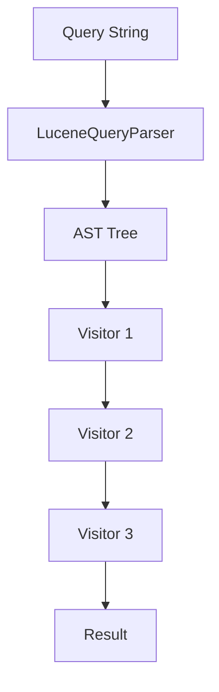

# Visitors

Foundatio.Parsers uses the visitor pattern for AST traversal and transformation. Visitors allow you to inspect, modify, or extract information from parsed queries.

## Visitor Pattern Overview

When a query is parsed, it creates an Abstract Syntax Tree (AST) of nodes. Visitors traverse this tree, performing operations on each node type.



## Built-in Visitors

### GenerateQueryVisitor

Converts an AST back to a query string:

```csharp
using Foundatio.Parsers.LuceneQueries;
using Foundatio.Parsers.LuceneQueries.Visitors;

var parser = new LuceneQueryParser();
var result = parser.Parse("status:active AND created:>2024-01-01");

// Generate query string from AST
string query = GenerateQueryVisitor.Run(result);
// Output: "status:active AND created:>2024-01-01"

// Async version
query = await GenerateQueryVisitor.RunAsync(result);
```

#### With Default Operator

```csharp
var context = new QueryVisitorContext {
    DefaultOperator = GroupOperator.And
};

var result = parser.Parse("value1 value2");
string query = await GenerateQueryVisitor.RunAsync(result, context);
// Output: "value1 AND value2"
```

### DebugQueryVisitor

Outputs the AST structure for debugging:

```csharp
var parser = new LuceneQueryParser();
var result = parser.Parse("(status:active OR status:pending) AND type:user");

string debug = DebugQueryVisitor.Run(result);
Console.WriteLine(debug);
```

Output:

```
Group:
  Operator: And
  Left - Group:
    HasParens: True
    Operator: Or
    Left - Term:
        Field: status
        Term: active
    Right - Term:
        Field: status
        Term: pending
  Right - Term:
      Field: type
      Term: user
```

### FieldResolverQueryVisitor

Resolves field aliases:

```csharp
var parser = new LuceneQueryParser();
var result = await parser.ParseAsync("user:john");

var fieldMap = new FieldMap {
    { "user", "data.user.identity" }
};

var resolved = await FieldResolverQueryVisitor.RunAsync(result, fieldMap);
// Result: data.user.identity:john
```

### IncludeVisitor

Expands query includes/macros:

```csharp
var parser = new LuceneQueryParser();
var result = await parser.ParseAsync("@include:active");

var includes = new Dictionary<string, string> {
    { "active", "status:active AND deleted:false" }
};

var expanded = await IncludeVisitor.RunAsync(result, includes);
// Result: (status:active AND deleted:false)
```

### ValidationVisitor

Validates queries against rules:

```csharp
var parser = new LuceneQueryParser();
var result = await parser.ParseAsync("status:active");

var context = new QueryVisitorContext();
context.SetValidationOptions(new QueryValidationOptions {
    AllowedFields = { "status", "name" }
});

await ValidationVisitor.RunAsync(result, context);

var validation = context.GetValidationResult();
Console.WriteLine($"Valid: {validation.IsValid}");
```

### InvertQueryVisitor

Inverts query negation:

```csharp
var parser = new LuceneQueryParser();
var result = await parser.ParseAsync("status:active");

var invertVisitor = new InvertQueryVisitor();
var inverted = await invertVisitor.AcceptAsync(result, new QueryVisitorContext());

string query = inverted.ToString();
// Output: "(NOT status:active)"
```

#### With Non-Inverted Fields

```csharp
// Some fields should not be inverted
var invertVisitor = new InvertQueryVisitor(
    nonInvertedFields: new[] { "organization_id", "tenant_id" });

var result = await parser.ParseAsync("status:active organization_id:123");
var inverted = await invertVisitor.AcceptAsync(result, context);
// Output: "(NOT status:active) organization_id:123"
```

### RemoveFieldsQueryVisitor

Removes specific fields from queries:

```csharp
var parser = new LuceneQueryParser();
var result = await parser.ParseAsync("status:active AND secret:value AND name:john");

var removeVisitor = new RemoveFieldsQueryVisitor(new[] { "secret" });
var cleaned = await removeVisitor.AcceptAsync(result, new QueryVisitorContext());

string query = cleaned.ToString();
// Output: "status:active AND name:john"
```

### CleanupQueryVisitor

Simplifies and cleans up the AST:

```csharp
var parser = new LuceneQueryParser();
var result = await parser.ParseAsync("((status:active))");

var cleaned = await CleanupQueryVisitor.RunAsync(result);
// Removes unnecessary nesting
```

### TermToFieldVisitor

Converts standalone terms to field queries (used for sort expressions):

```csharp
var parser = new LuceneQueryParser();
var result = await parser.ParseAsync("-created +name");

var converted = await TermToFieldVisitor.RunAsync(result);
// Converts terms to field nodes for sort processing
```

## Chained Visitors

Multiple visitors can be chained together with priority ordering:

```csharp
using Foundatio.Parsers.LuceneQueries.Visitors;

var chainedVisitor = new ChainedQueryVisitor();

// Add visitors with priority (lower runs first)
chainedVisitor.AddVisitor(new FieldResolverQueryVisitor(fieldResolver), priority: 10);
chainedVisitor.AddVisitor(new IncludeVisitor(), priority: 20);
chainedVisitor.AddVisitor(new ValidationVisitor(), priority: 30);

// Run all visitors
var result = await chainedVisitor.AcceptAsync(ast, context);
```

### Managing Chained Visitors

```csharp
var chain = new ChainedQueryVisitor();

// Add visitor
chain.AddVisitor(new MyVisitor(), priority: 100);

// Remove visitor by type
chain.RemoveVisitor<MyVisitor>();

// Replace visitor
chain.ReplaceVisitor<OldVisitor>(new NewVisitor(), newPriority: 50);

// Add before/after specific visitor
chain.AddVisitorBefore<ValidationVisitor>(new MyVisitor());
chain.AddVisitorAfter<FieldResolverQueryVisitor>(new MyVisitor());
```

## Visitor Context

Visitors receive a context object for sharing data:

```csharp
var context = new QueryVisitorContext();

// Set values
context.SetValue("UserId", "123");
context.SetValue("IsAdmin", true);

// Get values
string userId = context.GetValue<string>("UserId");
bool isAdmin = context.GetValue<bool>("IsAdmin");

// Default operator
context.DefaultOperator = GroupOperator.And;

// Default fields for unqualified terms
context.DefaultFields = new[] { "title", "description" };

// Query type
context.QueryType = QueryTypes.Query; // or Aggregation, Sort
```

### Context Extensions

```csharp
// Field resolver
context.SetFieldResolver(async (field, ctx) => {
    return fieldMap.GetValueOrDefault(field);
});
var resolver = context.GetFieldResolver();

// Include resolver
context.SetIncludeResolver(async name => includes.GetValueOrDefault(name));
var includeResolver = context.GetIncludeResolver();

// Validation
context.SetValidationOptions(options);
var validation = context.GetValidationResult();
context.AddValidationError("Error message", position: 5);
context.ThrowIfInvalid();
```

## AST Node Types

Visitors can handle different node types:

| Node Type | Description | Key Properties |
|-----------|-------------|----------------|
| `GroupNode` | Boolean group | `Left`, `Right`, `Operator`, `HasParens` |
| `TermNode` | Single term | `Field`, `Term`, `IsQuotedTerm`, `Boost`, `Proximity` |
| `TermRangeNode` | Range query | `Field`, `Min`, `Max`, `MinInclusive`, `MaxInclusive` |
| `ExistsNode` | Existence check | `Field` |
| `MissingNode` | Missing check | `Field` |

### Node Properties

```csharp
// Common to all field nodes
string field = node.Field;
string unescapedField = node.UnescapedField;
bool isNegated = node.IsNegated;
string prefix = node.Prefix; // +, -, or null

// TermNode specific
string term = termNode.Term;
bool isQuoted = termNode.IsQuotedTerm;
bool isRegex = termNode.IsRegexTerm;
string boost = termNode.Boost;
string proximity = termNode.Proximity;

// TermRangeNode specific
string min = rangeNode.Min;
string max = rangeNode.Max;
bool minInclusive = rangeNode.MinInclusive;
bool maxInclusive = rangeNode.MaxInclusive;

// GroupNode specific
IQueryNode left = groupNode.Left;
IQueryNode right = groupNode.Right;
GroupOperator op = groupNode.Operator; // And, Or, Default
bool hasParens = groupNode.HasParens;
```

### Node Data Dictionary

Nodes have a data dictionary for storing metadata:

```csharp
// Store custom data
node.Data["CustomKey"] = "CustomValue";

// Retrieve data
var value = node.Data.GetValueOrDefault("CustomKey");

// Extension methods for common data
node.SetOriginalField("alias");
string original = node.GetOriginalField();

node.SetTimeZone("America/New_York");
string tz = node.GetTimeZone();
```

## Visitor Base Classes

| Base Class | Description |
|------------|-------------|
| `QueryNodeVisitorBase` | Non-mutating visitor |
| `MutatingQueryNodeVisitorBase` | Can modify nodes |
| `QueryNodeVisitorWithResultBase<T>` | Returns a result |
| `ChainableQueryVisitor` | Can be chained |
| `ChainableMutatingQueryVisitor` | Chainable and mutating |

## Next Steps

- [Custom Visitors](./custom-visitors) - Create your own visitors
- [Elasticsearch Integration](./elastic-query-parser) - Elasticsearch-specific visitors
- [Field Aliases](./field-aliases) - Field resolution
