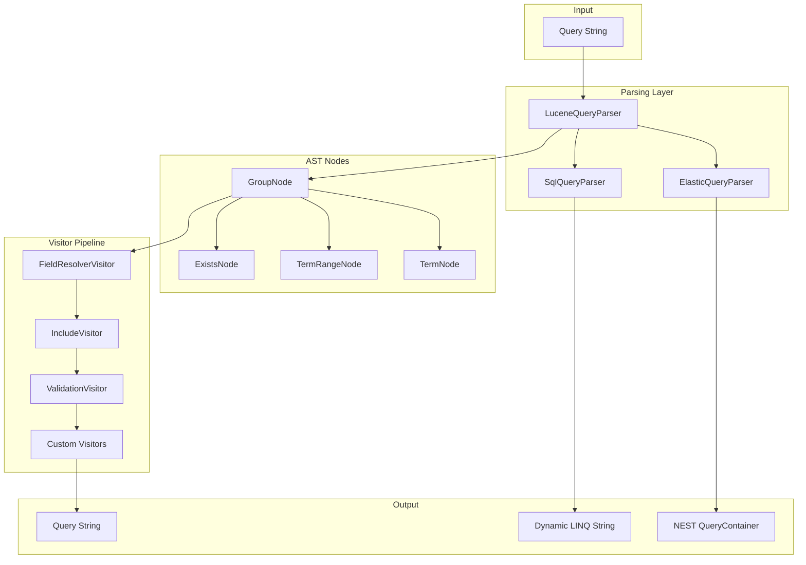

# What is Foundatio.Parsers?

Foundatio.Parsers is a production-grade query parsing library for .NET that provides extensible Lucene-style query syntax parsing with specialized support for Elasticsearch and SQL/Entity Framework Core.

## Key Features

- **Lucene Query Syntax** - Parse standardized query syntax compatible with Lucene and Elasticsearch
- **Elasticsearch Integration** - Enhanced `query_string` replacement with dynamic queries, aggregations, and sorting
- **SQL/EF Core Integration** - Generate Dynamic LINQ expressions for Entity Framework Core
- **Visitor Pattern** - Extensible AST traversal for custom query transformations
- **Field Aliases** - Static and dynamic field name mapping
- **Query Includes** - Macro expansion for reusable query fragments
- **Validation** - Syntax validation, field restrictions, and operation limits

## Architecture

Foundatio.Parsers uses a layered architecture built on the visitor pattern:



### Parsing Layer

The core `LuceneQueryParser` parses query strings into an Abstract Syntax Tree (AST). The `ElasticQueryParser` and `SqlQueryParser` extend this base parser with specialized visitor chains for their respective outputs.

### AST Nodes

Queries are represented as a tree of typed nodes:

| Node Type | Description | Example |
|-----------|-------------|---------|
| `GroupNode` | Groups child nodes with boolean operators | `(a OR b) AND c` |
| `TermNode` | Single term or phrase query | `field:value`, `field:"quoted"` |
| `TermRangeNode` | Range query | `field:[1 TO 10]`, `field:>5` |
| `ExistsNode` | Field existence check | `_exists_:field` |
| `MissingNode` | Field absence check | `_missing_:field` |

### Visitor Pipeline

Visitors traverse the AST to transform, validate, or extract information. Multiple visitors can be chained together with priority ordering.

## Use Cases

### Dynamic Search APIs

Expose powerful search capabilities to end users:

```csharp
// User-provided query
string userQuery = "status:active AND created:>2024-01-01";

var parser = new ElasticQueryParser(c => c
    .UseMappings(client, index)
    .SetValidationOptions(new QueryValidationOptions {
        AllowedFields = { "status", "created", "name" }
    }));

var query = await parser.BuildQueryAsync(userQuery);
```

### Custom Dashboards and Views

Let users build custom aggregations:

```csharp
// User-defined aggregation
string userAgg = "terms:(status date:created~month min:amount max:amount)";

var aggs = await parser.BuildAggregationsAsync(userAgg);
```

### Query Translation

Translate queries between different backends:

```csharp
// Parse once, output to multiple formats
var luceneParser = new LuceneQueryParser();
var ast = await luceneParser.ParseAsync("field:value AND other:[1 TO 10]");

// Regenerate the query string from the AST
string queryString = await GenerateQueryVisitor.RunAsync(ast);

// Generate Elasticsearch query
var elasticParser = new ElasticQueryParser();
var esQuery = await elasticParser.BuildQueryAsync(ast);

// Generate SQL (requires a context with entity type info)
var sqlParser = new SqlQueryParser();
var sqlQuery = await sqlParser.ToDynamicLinqAsync(queryString, context);
```

## Packages

| Package | Description |
|---------|-------------|
| `Foundatio.Parsers.LuceneQueries` | Core Lucene query parser and visitors |
| `Foundatio.Parsers.ElasticQueries` | Elasticsearch/NEST integration |
| `Foundatio.Parsers.SqlQueries` | SQL/Entity Framework Core integration |

## Next Steps

- [Getting Started](./getting-started) - Installation and basic usage
- [Query Syntax](./query-syntax) - Complete query syntax reference
- [Elasticsearch Integration](./elastic-query-parser) - Building Elasticsearch queries
- [SQL Integration](./sql-query-parser) - Entity Framework Core integration
